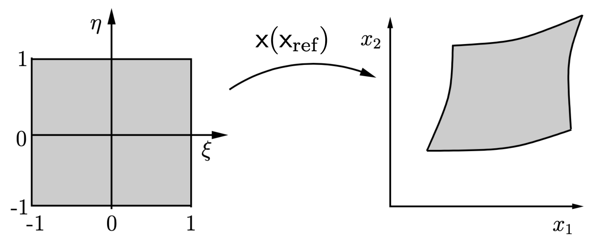
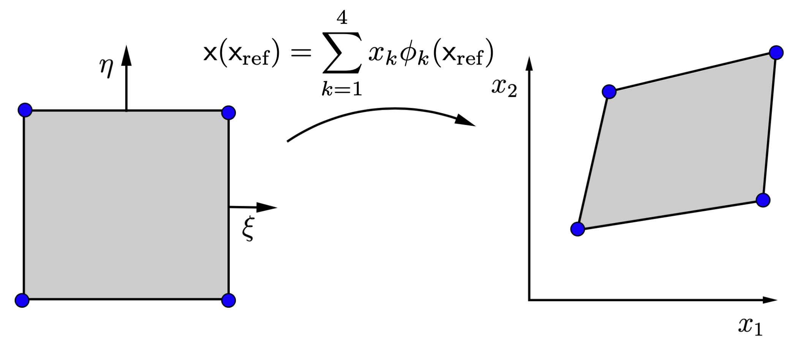
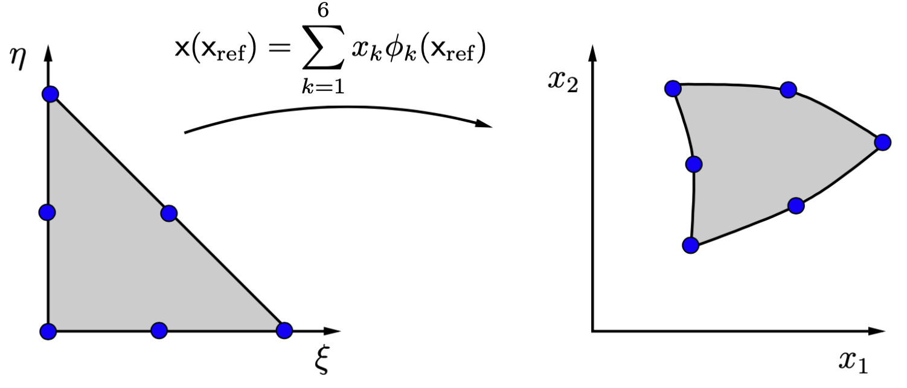
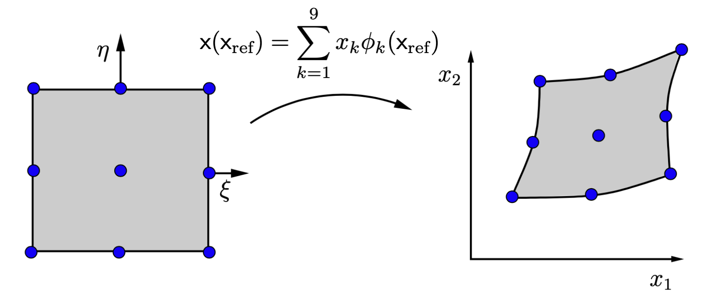

(Chap2)=
# Introduction to the finite element method


In this chapter we introduce the finite element method using the steady diffusion equation as an example.
A typical application of the steady diffusion problem is predicting the 
temperature distribution in a medium at rest (no convection).

## The steady diffusion equation

We consider the following steady diffusion equation for a scalar field $u$ in a region $\Omega$:

$$
  -\nao\cdot(\alpha\nao u) = f\text{ in }\Omega
$$ (eq1-chap2)

with boundary conditions

$$
    u = u_D\text{ on }\Gamma_D
$$ (eq2-chap2)

$$
    -\alpha\pderiv{u}{n}=-\vek n\cdot\alpha\nao u=h_{\text{N}}\text{ on }\Gamma_{\text{N}}
$$ (eq3-chap2)

where the boundary $\Gamma=\Gamma_\text{D}\cup\Gamma_{\text{N}}$ has been split into a
*Dirichlet* and a *Neumann* part (see {numref}`fig1-chap2`).

```{figure-md} fig1-chap2


Domain $\Omega$ with boundary $\Gamma=\Gamma_\text{D}\cup\Gamma_{\text{N}}$, outwardly directed unit normal vector $\vek n$ on $\Gamma$, imposed field value $u_\text{D}$ on $\Gamma_\text{D}$ and imposed normal flux $h_\text{N}$ on the Neumann boundary.
```


<a name="Remark:2.1"></a>
```{admonition} Remark 2.1
:class: note

Dirichlet boundary conditions are also called *essential* boundary conditions, whereas Neumann boundary conditions are also known as *natural* boundary conditions.
```

<a name="Remark:2.2"></a>
```{admonition} Remark 2.2
:class: note

Other types of boundary conditions are possible, for example Robin boundary conditions:

$$
   u + a\dpderiv{u}{n}=b
$$ (eq4-chap2)

on a part of the boundary. However, these will not be considered here.
```


<a name="Remark:2.3"></a>
```{admonition} Remark 2.3
:class: note

The coefficient $\alpha$ must be positive ($\alpha>0$) and can be a function of $\vek x$.
  For constant $\alpha$, Equation {eq}`eq1-chap2` reduces to $-\alpha\nabla^2u=f$. For $\alpha=1$, this equation is called the *Poisson equation*.
```

<a name="Remark:2.4"></a>
```{admonition} Remark 2.4
:class: note

The vector $\vek q=-\alpha\nao u$ is called the *flux vector* and $h_n=\vek q\cdot\vek n$ the normal flux through the boundary $\Gamma$ (imposed on $\Gamma_\text{N}$).For a temperature problem, $u$ is the temperature, $\alpha$ is the thermal conductivity,
$\vek q$ the energy flux vector and $h_n$ the energy flux through the boundary.
```

<a name="Remark:2.5"></a>
```{admonition} Remark 2.5
:class: note


 A *Neumann* problem is a problem, where the Neumann boundary is the complete boundary, i.e. $\Gamma_\text{N}=\Gamma$. For a Neumann problem, the field $u$ is only unique up to an arbitrary constant. This constant  can be specified by an additional condition, such as a prescribed value in a single point or a condition like

$$
   \int_\Omega u\,d\Omega = 0
$$

Additionally, the following *compatibility condition* must be fulfilled for 
the imposed boundary flux $h_\text{N}$:

$$
   \int_\Gamma h_\text{N}\,d\Gamma=\int_\Omega f\,d\Omega
$$ (eq5-chap2)

which follows from integrating Equation {eq}`eq1-chap2` over $\Omega$ and applying the divergence theorem Equation {eq}`eq4-A`:

$$
    \int_\Omega f\,d\Omega = -\int_\Omega \nao\cdot (\alpha\nao u)\,d\Omega = 
       -\int_\Gamma \vek n\cdot ( \alpha\nao u)\,d\Gamma = 
   \int_\Gamma h_\text{N}\,d\Gamma
$$ (eq6-chap2)

For the temperature (energy) equation the compatibility condition means, that the boundary flux $h_\text{N}$ must fulfill the global energy balance, i.e. all the energy added inside the domain (through $f$) must be equal to the energy leaving the domain through the boundary.
```

## Minimization of a quadratic functional

Many physical problems can be formulated as a minimum principle. Each possible solution of the problem is given a certain *real number*. The exact solution is obtained if this real number is minimal. The mapping from a function to a real number is called a *functional* (“a function of a function”). The minimum principle is therefore formulated as the minimization of a functional. The field of mathematics involved in finding extrema of functionals is called *variational calculus*.

The diffusion problem Equation {eq}`eq1-chap2` can also be formulated as a minimum principle. The solution to the diffusion problem Equations {eq}`eq1-chap2`--{eq}`eq3-chap2` minimizes the following quadratic functional

$$
   I(u) = \frac12\int_\Omega\alpha\nao u\cdot\nao u\,d\Omega-\int_\Omega uf\,d\Omega+\int_{\Gamma_\text{N}}u h_\text{N}\,d\Gamma 
$$ (eq7-chap2)

where $u$ must be chosen from the set of functions that fulfills the Dirichlet condition Equation {eq}`eq2-chap2`. We exclude the Neumann problem, which needs a special treatment (see also [Remark 2.5](#Remark:2.5)).

In order to prove the minimum principle, we introduce a class of functions $\hat u(\vek x)$ that differ only slightly from
the solution $ u(\vek x)$ of the problem:

$$
  \hat u(\vek x) = u(\vek x) + \epsilon v(\vek x) 
$$ (eq8-chap2)

where $\epsilon$ is a small variable number and $v(\vek x)$ is a fixed arbitrary function that is zero on the Dirichlet boundary, i.e. $v(\vek x)=0$ on $\Gamma_\text{D}$. The latter condition ensures that both $u(\vek x)$ and $\hat u(\vek x)$ fulfill the Dirichlet condition. The function $\epsilon v(\vek x)$ is called the *variation* of $u$ and denoted by $\delta u$.

Substituting $\hat u$ according to Equation {eq}`eq8-chap2` into the functional $I$ given by Equation {eq}`eq7-chap2`, we get

$$
\begin{split}
   I(\hat u) &= I(u+\epsilon v)\\
    &=\frac12\int_\Omega\alpha\nao(u+\epsilon v)\cdot\nao (u+\epsilon v)\,d\Omega-\int_\Omega (u+\epsilon v)f\,d\Omega+\int_{\Gamma_\text{N}}(u+\epsilon v) h_\text{N}\,d\Gamma\\
    &=I(u)
   +\epsilon\left(\int_\Omega\alpha\nao v\cdot\nao u\,d\Omega-\int_\Omega vf\,d\Omega+\int_{\Gamma_\text{N}}vh_\text{N}\,d\Gamma\right)+\frac{\epsilon^2}2\int_\Omega\alpha\nao v\cdot\nao v\,d\Omega
\end{split}\label{I_expansion_pois}
$$ (eq9-chap2)

The solution $u$ is in a minimum of $I$ if

$$
    \deriv{I(\hat u)}\epsilon\big|_{\epsilon=0}=0,\text{ and }\deriv{^2I(\hat u)}{\epsilon^2}\big|_{\epsilon=0}>0
$$ (eq10-chap2)

The second condition is indeed fulfilled, since

$$
    \deriv{^2I(\hat u)}{\epsilon^2}\big|_{\epsilon=0}=\frac{1}2\int_\Omega\alpha\nao v\cdot\nao v\,d\Omega
$$ (eq11-chap2)

which is positive for $v\neq0$. The choice of $v=0$ must be excluded here, since the variation $\delta u=0$ in that case, whatever the choice of $\epsilon$.

````{exercise} Exercise 2.1
:label: ex:2.1

 A choice of $v=c$, where $c\neq0$ is a constant, leads to a zero value of the second derivative. Why is this not a valid choice for the function $v$?

 ````

 The first condition in Equation {eq}`eq10-chap2` leads to the term linear in $\epsilon$ to be zero:

$$
 \int_\Omega\alpha\nao v\cdot\nao u\,d\Omega-\int_\Omega vf\,d\Omega+\int_{\Gamma_\text{N}}vh_\text{N}\,d\Gamma =0
$$ (eq12-chap2)

which needs to be valid for *any* function $v(\vek x)$
with $v(\vek x)=0$ on $\Gamma_\text{D}$.

````{exercise} Exercise 2.2
:label: ex:2.2
Show that if $u$ minimizes $I$, the minimum value is

$$
    I(u) = - \frac{1}2\int_\Omega\alpha\nao u\cdot\nao u\,d\Omega
$$

 ````

<a name="Remark:2.6"></a>
```{admonition} Remark 2.6
:class: note

 The term in Equation {eq}`eq9-chap2` that is linear in $\epsilon$ is called the *variation* of $I(u)$, denoted by $\delta I(u)$, and can be written in terms of $\delta u$ as 

$$
 \delta I(u)=\int_\Omega\alpha\nao (\delta u)\cdot\nao u\,d\Omega-\int_\Omega \delta uf\,d\Omega+\int_{\Gamma_\text{N}}\delta uh_\text{N}\,d\Gamma
$$ (eq13-chap2)

The variation can be seen as an infinitesimal differental operator and “standard” differentation rules can be applied to derive $\delta I(u)$ in terms of $\delta u$. The condition for the minimum of $I$ given by Equation {eq}`eq12-chap2` can also be written as $\delta I(u)=0$.

```

In order to prove that the solution of $u$ that minimizes $I(u)$ is the solution to the diffusion problem Equations {eq}`eq1-chap2`--{eq}`eq3-chap2` we rewrite Equation {eq}`eq12-chap2`. First use Equation {eq}`eq3-A` (second equation) to find that

$$
  \alpha\nao v\cdot\nao u=\nao\cdot(v\alpha\nao u)-v\nao\cdot(\alpha\nao u)
$$ (eq14-chap2)

Substituting this into Equation {eq}`eq12-chap2` and applying Gauss's theorem Equation {eq}`eq4-A`, we get

$$
   \int_\Omega v\big(-\nao\cdot(\alpha\nao u)-f\big)\,d\Omega-\int_{\Gamma_\text{D}}vh_n\,d\Gamma
     +\int_{\Gamma_\text{N}}v(h_\text{N}-h_n)\,d\Gamma =0
$$ (eq15-chap2)

where $h_n=\alpha\vek n\cdot\nao u$ is the normal flux through the boundary. Since $v=0$ on $\Gamma_\text{D}$, the second integral vanishes. Limiting the functions $v$ to functions that have $v=0$ on the whole boundary $\Gamma$ gives:

$$
 \int_\Omega v\big(-\nao\cdot(\alpha\nao u)-f\big)\,d\Omega=0\label{eq:tmp02}
$$ (eq16-chap2)

for all $v$ being zero on $\Gamma$. Now we apply the fundamental lemma of variational calculus, which basically says: for any integrable function $g$ defined on $\Omega$ for which 

$$
    \int_\Omega v g\,d\Omega=0
$$

for any arbitrary function $v$ in $\Omega$, it follows that $g=0$ in $\Omega$. Applying this lemma to Equation {eq}`eq16-chap2` immediately leads to the equation of the diffusion problem given in Equation {eq}`eq1-chap2`. 
This also means, that Equation {eq}`eq15-chap2` reduces to

$$
  \int_{\Gamma_\text{N}}v(h_\text{N}-h_n)\,d\Gamma =0
$$

Applying a similar fundamental lemma to the boundary, leads to $h=h_\text{N}$ on  $\Gamma_\text{N}$, i.e.
$u$ fulfills the Neumann boundary condition Equation {eq}`eq3-chap2`. This finalizes the proof.

(chap2.3)=
## Weak formulation

In the previous section we learned that the minimization of the quadratic functional $I(u)$, given in Equation {eq}`eq7-chap2`, leads to the requirement for $u$ as given in Equation {eq}`eq12-chap2`. It turns out that this requirement leads to the original diffusion problem Equations {eq}`eq1-chap2`--{eq}`eq3-chap2`. This requirement is called the *weak* formulation of the diffusion problem. The original diffusion problem, Equations {eq}`eq1-chap2`--{eq}`eq3-chap2` is called the *classical* or *strong* formulation. Since the weak formulation is central to the finite element method, we will also derive the weak formulation starting from the strong formulation. This will lead to the same weak form, but this procedure will also be applicable to problems for which no minimization principle exists.


<a name="Remark:2.7"></a>
```{admonition} Remark 2.7
:class: note
 Although the weak formulation and the strong formulation seem to be equivalent, this is not so. In the strong formulation the PDE must be valid point for point. This means, that the right-hand side $f$ in Equation {eq}`eq1-chap2` must be a continuous function and the second derivatives of the solution $u$ must be continuous as well. In the weak formulation Equation {eq}`eq12-chap2`, these requirements are relaxed. Only the integrals must exist, allowing discontinuous functions for $f$ and $\alpha$ and discontinuous solutions for $\nao u$.


```

The diffusion equation Equation {eq}`eq1-chap2` is a system in the unknown field (function) $u(\vek x)$.  When deriving the weak form we need to be aware, that this function requires a proper function space. To keep it simple, we will avoid the choice of proper function spaces as much as possible by saying that they need to be as big as possible as allowed by the theory. We will denote the corresponding function space by $U$. The solution space $U$ is also called a *trial space*.

We start from Equation {eq}`eq1-chap2`, and bring $f$ to the left-hand side:

$$
     -\nao\cdot(\alpha\nao u) - f = 0\text{ in }\Omega
$$ (eq17-chap2)

multiply this equation with a *test* function $v(\vek x)$, and integrate over the domain $\Omega$:

$$
     \int_\Omega v(-\nao\cdot(\alpha\nao u) - f)\,d\Omega= 0
$$ (eq18-chap2)

which is true for *all* test functions $v\in V$, provided $u$ is a solution of the diffusion equation. The space $V$ is called the *test* space.

<a name="Remark:2.8"></a>
```{admonition} Remark 2.8
:class: note

In the mathematical literature on finite element methods the integrals in the weak form 
are interpreted as *inner products* on function spaces. For that, the following inner products are introduced:

$$
\begin{gather*}
  (a,b) = \int_{\Omega}ab\,d\Omega, \quad (\vek a,\vek b) = \int_{\Omega}\vek a\cdot\vek b\,d\Omega,\\
    (\ten A,\ten B) = \int_{\Omega}\ten A:\ten B\,d\Omega, \quad (\vek a,\vek b)_\Gamma = \int_{\Gamma}\vek a\cdot\vek b\,d\Gamma.
\end{gather*}
$$

for scalar functions $a$ and $b$, vector functions $\vek a$ and $\vek b$, and tensor functions $\ten A$ and $\ten B$.

```

<a name="Remark:2.9"></a>
```{admonition} Remark 2.9
:class: note

The procedure above for deriving a weak form is also known as the *method of weighted residuals*. 
The *residual*, i.e. the left-hand side minus the right-hand side is multiplied with a test function and integrated over the domain. Using the notation of [Remark 2.8](#Remark:2.8), Equation {eq}`eq18-chap2` can be written as

$$
    (v,r)=0,\qquad\text{with }r=-\nao\cdot(\alpha\nao u) - f
$$

for all test functions $v\in V$, where the residual $r$ follows from Equation {eq}`eq17-chap2`. Another way of expressing this is: the residual is required to be *orthogonal* to all functions from the test space $V$.

```

We will impose the Dirichlet condition Equation {eq}`eq2-chap2` in a strong way on the trial space $U$, i.e. functions from this trial space should already fulfill the Dirichlet condition. In that case, we must also restrict the test space $V$ in the following way:

$$
     v = 0\qquad\text{ on }\Gamma_D
$$ (eq19-chap2)

Although Equation {eq}`eq18-chap2` is already a weak formulation, the restrictions on $u$ are still too high for regular finite elements. In order to lower the requirements, we are going to partial integrate the second order term by using (see also Equation {eq}`eq14-chap2`):

$$
  -v\nao\cdot(\alpha\nao u)=\alpha\nao v\cdot\nao u-\nao\cdot(v\alpha\nao u)
$$ (eq20-chap2)

Substituting this into Equation {eq}`eq18-chap2` and applying Gauss's theorem Equation {eq}`eq4-A`,
we get,

$$
 \int_\Omega\alpha\nao v\cdot\nao u\,d\Omega-\int_{\Gamma}v\alpha\vek n\cdot\nao u\,d\Gamma
 -\int_\Omega vf\,d\Omega=0
$$ (eq21-chap2)

As a final step we fill in the Neumann boundary condition of $\Gamma_\text{N}$ in Equation {eq}`eq3-chap2` and the test function restriction Equation {eq}`eq19-chap2` on $\Gamma_{\text{D}}$ to arrive at the following weak form of the diffusion equation:
find $u\in U$ such that

$$
 \int_\Omega\alpha\nao v\cdot\nao u\,d\Omega=\int_\Omega vf\,d\Omega-\int_{\Gamma_\text{N}}vh_\text{N}\,d\Gamma
$$ (eq22-chap2)

for all $v\in V$. This weak from is identical to the weak form obtained from minimization of the functional $I(u)$ in the previous section.


<a name="Remark:2.10"></a>
```{admonition} Remark 2.10
:class: note

Using the notation for inner products introduced in [Remark 2.8](#Remark:2.8),
the weak form of the diffusion equation can be written as: find $u\in U$ such that

$$
 (\nao v,\alpha\nao u)=(v,f)-(v,h_\text{N})_{\Gamma_\text{N}}
$$ (eq23-chap2)

for all $v\in V$, or with the shorthand notation

$$
  a(v,u) = \int_\Omega \alpha\nao v\cdot\nao u\,d\Omega
$$ (eq24-chap2)

we get an even shorter form

$$
 a(v,u)=(v,f)-(v,h_\text{N})_{\Gamma_\text{N}}
$$ (eq25-chap2)

```


<a name="Remark:2.11"></a>
```{admonition} Remark 2.11
:class: note

In order for the integrals of function products in the weak form to be meaningful, the (components) of these functions need to be chosen from the space of square integrable functions $L^2(\Omega)$, in mathematical terms:

$$
  L^2(\Omega)=\lbrace u: \Omega \rightarrow \mathbb{R}\,\vert \int_\Omega u^2\,d\Omega <\infty \rbrace
$$ (eq26-chap2)

or in words: the integral of the square of a function needs to be finite. 
In engineering practice it means that discontinuities (jumps) are allowed, but Dirac delta functions are not.
Since there are gradients of the solution $u$, 
an even more restrictive function space is needed: the $H^1(\Omega)$, where the components of the gradient are also in the $L^2(\Omega)$, or in mathematical terms:

$$
  H^1(\Omega)=\lbrace u: \Omega \rightarrow \mathbb{R}\,\vert u, \pderiv{u\,\,}{x_1},\pderiv{u\,\,}{x_2},\pderiv{u\,\,}{x_3} \in L^2(\Omega) \rbrace
$$ (eq27-chap2)

In engineering practice it means that functions need to be continuous ($C^0(\Omega)$), since jumps would lead to Dirac delta functions for the derivatives. Using the above definition, we can define 

$$
\begin{align*}
    U&=\lbrace  u\in H^1(\Omega)\,\vert\,  u= u_\text{D}\text{ on }\Gamma_\text{D}\rbrace\\
    V&=\lbrace  v\in H^1(\Omega)\,\vert\,  v= 0\text{ on }\Gamma_\text{D}\rbrace
\end{align*}
$$

Note, that $ U$ is only a linear (or vector) space if $ u_\text{D}= 0$, since for $ u_\text{D}\neq 0$ addition of two elements from $ U$ will result in a function not in $ U$. The test space $ V$ is a vector space, though.

```

## The method of Ritz

In a paper that appeared in 1908, Ritz was the first to use variational methods [^1] as a means to obtain an *approximate* solution for a PDE [^2]. He suggested to write the approximate solution as a linear combination of a set of $N$ *basis functions* 
$\phi_k(\vek x)$, $k=1,\dots,N$:

$$
   u_N(\vek x) = \sum_{k=1}^{N} u_k\phi_k(\vek x) 
$$ (eq28-chap2)

where the functions $\phi_k(\vek x)$ should, ideally, be chosen as close to the expected solution as possible. To keep the derivation in this section as simple as possible, we have assumed homogeneous Dirichlet boundary conditions, i.e. $u_\text{D}=0$ in Equation {eq}`eq2-chap2` for the steady diffusion equation.
All functions $\phi_k(\vek x)$ must therefore be zero on $\Gamma_\text{D}$.

In order to find the “best” values for the coefficients $u_k$, $k=1,\dots,N$, Ritz used the minimization argument. The exact solution $u$ minimizes the functional $I(u)$, therefore it is expected that the coefficients $u_k$ that minimize $I(u_N)$ gives the approximation that is as close as possible to the exact solution. Substituting Equation {eq}`eq28-chap2` into  the expression for $I(u)$, i.e. Equation {eq}`eq7-chap2`, will give 
$I(u)= I_N(u_1,u_2,\dots,u_{N})$ and minimization leads to

$$
    \pderiv{I_N(u_1,u_2,\dots,u_{N})}{u_k}=0,\quad k=1,\dots,N\label{eq:minimumapproxI}
$$ (eq29-chap2)

which will give $N$ equations for the $N$ unknown coefficients.

Substitution of Equation {eq}`eq28-chap2` into {eq}`eq7-chap2` leads to

$$
  I_N(u_1,u_2,\dots,n_{N})= \sum_{k=1}^N(\sum_{m=1}^N \frac12 u_k A_{km}u_m-u_k f_k)
$$ (eq30-chap2)

with

$$
A_{km} = \int_\Omega \alpha \nao\phi_k\cdot\nao\phi_m\,d\Omega, \qquad
k,m=1,\dots N
$$ (eq31-chap2)

$$
f_k=\int_\Omega \phi_kf\,d\Omega
      -\int_{\Gamma_\text{N}}\phi_kh_\text{N}\,d\Gamma, \qquad k=1,\dots N
$$ (eq32-chap2)

````{exercise} Exercise 2.3
:label: ex:2.3
 Derive Equation {eq}`eq31-chap2` and Equation {eq}`eq32-chap2`.

````

````{exercise} Exercise 2.4
:label: ex:2.4

 Show that $A_{km}=A_{mk}$.
 ````

Applying {eq}`eq29-chap2` leads to the following system of equations for $u_k$:

$$
   \sum_{m=1}^N A_{km} u_m = f_k, \qquad k=1,\dots N\label{eq:discr_pois_Ritz}
$$ (eq33-chap2)

or in matrix form

$$
  \mat A \col u = \col f
$$ (eq34-chap2)

where $\mat A$ is an $N\times N$ matrix and $\col u$, $\col f$ are columns of size $N$, constructed from the components $A_{km}$, $u_k$ and $f_k$, respectively.


````{exercise} Exercise 2.5
:label: ex:2.5

 Derive Equation {eq}`eq33-chap2`.
````

````{exercise} Exercise 2.6
:label: ex:2.6

 Show that the matrix $\mat A$ is symmetric.
````

````{exercise} Exercise 2.7
:label: ex:2.7

 Show that the matrix $\mat A$ is positive definite, i.e.

$$
    \col u^T \mat A \col u > 0\quad\text{for any }\col u\neq \col0,
$$

assuming that it is not a Neumann problem.
````

The method of Ritz is appealing in the sense, that it is relatively easy to understand. Also the minimization procedure gives a natural feeling, that the obtained approximate solution must be “optimal” with respect to accuracy for a given set of basis functions. A drawback is, that it is only applicable to problems for which a minimum principal exists. Therefore another approximation method, the Galerkin method, is commonly used instead. If a minimum principal exists, the Galerkin method gives results identical to the method of Ritz. The Galerkin method is the topic of the next section.

(Chap2.5)=
## The Galerkin method

The objective of this section is to introduce the *Galerkin* discretization technique. 
Similar to the method of Ritz, a
finite set of discretized equations is obtained, 
approximating the original differential equation with boundary conditions.

The Galerkin method is based on the weak form Equation {eq}`eq22-chap2`.
The first step is to limit the trial space $U$
to finite dimensional (sub)spaces using a finite set of basis functions. 
The second step consists of limiting the test space
$V$ to finite dimensional (sub)spaces using the *same set of basis functions*. The finite dimensional approximation spaces will be denoted by the subscript $h$, i.e. $U_h$ and $V_h$, respectively.

<a name="Remark:2.12"></a>
```{admonition} Remark 2.12
:class: note
Denoting the approximation spaces by adding a subscript $h$ is quite common in the finite element literature. The subscript $h$ denotes a characteristic length scale of the *mesh* for defining the discretization {cite}`Hughes2000`.

```

<a name="Remark:2.13"></a>
```{admonition} Remark 2.13
:class: note
The Galerkin technique is also referred to as *Bubnov-Galerkin*. The *Petrov-Galerkin* technique is different, in the sense that the basis functions for the test spaces are different from the basis functions for the trial spaces {cite}`Hughes2000`.

```

For defining the approximation trial space $U_h$ we write the elements of this space as a linear combination of the *basis functions* $\phi_k(\vek x)$, $k=1,\dots,N$.

$$
 u_h(\vek x)=\sum_{k=1}^{N} u_k\phi_k(\vek x)
  \label{eq:trialspace_pois}
$$ (eq35-chap2)

Similarly, the test space $V_h$ is defined by writing elements of this space as a linear combination of the same basis functions as used for $U_h$:

$$
 v_h(\vek x)=\sum_{k=1}^{N} v_k\phi_k(\vek x)
$$ (eq36-chap2)

<a name="Remark:2.14"></a>
```{admonition} Remark 2.14
Basis functions are also referred to as *shape* or *interpolation* functions {cite}`Hughes2000`.

```

<a name="Remark:2.15"></a>
```{admonition} Remark 2.15
The space $U_h$ is a subspace of $U$ ($U_h\subset U$) and upon increasing the number of degrees of freedom, i.e. $N \rightarrow\infty$, the discretized space $U_h$ should approach the real space $U$.  

```

A subtlety still being ignored is that the Dirichlet conditions should be imposed on the space $U$ and the subset requirement of [Remark 2.15](#Remark:2.15) requires this to be true even for the subset $U_h$. A possibility to impose the Dirichlet condition on $U_h$ is to define the basis functions $\phi_k$ such, that they vanish on $\Gamma_\text{D}$ and define an element from $U_h$ as 

$$
  u_h(\vek x)=\sum_{k=1}^{N_{u}} u_k\phi_k(\vek x) + g(\vek x)
$$ (eq37-chap2)

where the function $g(\vek x)=u_\text{D}$ for $\vek x$ on $\Gamma_\text{D}$. 
Such a procedure is not very practical in a finite element code and in Section {numref}`Chap2.7.3` we will discuss a more practical solution for this problem. For the purpose of this section, we assume that $u_\text{D}=0$ and thus also $g(\vek x)=0$.

The discretized steady diffusion equation can now be obtained by replacing the spaces $U$ and $V$ with the finite dimensional approximation space $U_h$ and $V_h$ in the weak form Equation {eq}`eq22-chap2`: find $u_h\in U_h$ such that

$$
 \int_\Omega\alpha\nao v_h\cdot\nao u_h\,d\Omega=\int_\Omega v_hf\,d\Omega-\int_{\Gamma_\text{N}}v_h h_\text{N}\,d\Gamma
$$ (eq38-chap2)

for all $v_h\in V_h$.

Using Equation {eq}`eq35-chap2` and Equation {eq}`eq36-chap2` we find that

$$
   \nao u_h=\sum_{k=1}^{N}u_k\nao\phi_k, \quad \nao v_h=\sum_{k=1}^{N}v_k\nao\phi_k
$$ (eq39-chap2)

and the discretized weak form Equation {eq}`eq38-chap2` can be written as

$$
\sum_{k=1}^{N} v_k (\sum_{m=1}^{N} A_{km}u_m 
-f_k)=0
$$ (eq40-chap2)

for all $v_k$, $k=1,\dots N$ with

$$
  A_{km} = \int_\Omega \alpha \nao\phi_k\cdot\nao\phi_m\,d\Omega, \qquad
  k,m=1,\dots N
$$ (eq41-chap2)

$$
  f_k=\int_\Omega \phi_kf\,d\Omega
        -\int_{\Gamma_\text{N}}\phi_kh_\text{N}\,d\Gamma, \qquad k=1,\dots N
$$ (eq42-chap2)

Since Equation {eq}`eq40-chap2` must be fulfilled for any $v_k$, we obtain the following set of equations
 for $u_k$:

$$
   \sum_{m=1}^N A_{km} u_m = f_k, \qquad k=1,\dots N
$$ (eq43-chap2)

or in matrix form

$$
  \mat A\col u = \col f
$$ (eq44-chap2)

where $\mat A$ is an $N\times N$ matrix and $\col u$, $\col f$ columns of size $N$, constructed from the components $A_{km}$, $u_k$ and $f_k$, respectively. Comparing Equation {eq}`eq43-chap2` with Equation {eq}`eq33-chap2` we can conclude that the method of Ritz and the Galerkin method lead to the same set of discretized equations in this case.

````{exercise} Exercise 2.8
:label: ex:2.8
  Derive the expressions for $A_{km}$ and $f_k$ as given by Equations {eq}`eq41-chap2`-{eq}`eq42-chap2`.

````

(Chap2.6)=
## Basis functions for the finite element method

### General

For the Galerkin method we have used a finite set of basis functions $\phi_k(\vek x)$, $k=1,\dots,N$ to define an approximate solution as follows

$$
   u_h(\vek x) = \sum_{k=1}^{N} u_k\phi_k(\vek x)
$$ (eq45-chap2)

The basis functions are defined *globally*, i.e. for all $\vek x$ in the domain $\Omega$. In order to obtain sparse matrices for the discretized system, the basis functions need to have *compact support*, i.e. non-zero in only a small confined region. The *finite element method*, is basically a Galerkin method with a special choice of the basis functions to obtain sparse matrices.

In the finite element method the basis functions are defined using *elements*. For this, the domain is divided into small subdomains (the elements):

$$
\Omega=\cup_e\Omega_e, \quad\Omega_{e}\cap\Omega_{f}=\emptyset\quad
   \text{for }e\neq f
$$

i.e. the elements are not overlapping and fill the complete domain. The division into elements of the domain is called a *mesh* of the domain. The shape of an element is simple, usually triangles or quadrilaterals in 2D and tetrahedra or hexahedra in 3D. The basis functions are defined by assuming polynomial interpolation functions on each element (“piecewise polynomials”) and imposing some continuity requirement between elements. The continuity requirement depends on the weak form of the PDE that is being discretized, but for the standard second-order 
PDE's requiring continuity of the basis functions at element edges ($\phi_k(\vek x)\in C^0(\Omega)$) is sufficient.

Finite element basis functions are usually defined such, that the coefficients $u_k$ in 
Equation {eq}`eq45-chap2` are actual values of the approximation $u_h(\vek x)$ in certain points $\vek x_k$, $k=1,\dots,N$, the so-called *nodes*. In order to achieve that, the basis functions must fulfill the *Kronecker delta property*:

$$
   \phi_i(\vek x_j)=\delta_{ij}, \quad i,j=1,\dots,N
$$ (eq46-chap2)

This property leads to basis functions that have *compact support*, i.e. are only non-zero in a small region of the domain. For example, in Figure {numref}`fig2-chap2` a mesh consisting of triangles is shown. The nodes of the mesh are defined in the points where the vertices of the triangles are connected. In the figure a single node ($k$) is indicated. The basis function $\phi_k$ is linear in each element, has a value of 1 in the node $k$ and zero in all other nodes. This means, that $\phi_k$ is non-zero only on the *patch* of elements connected to node $k$, denoted by the grey region in Figure {numref}`fig2-chap2` . In Figure {numref}`fig3-chap2` a 3D view of the basis functions $\phi_k$ is shown. Note, that $\phi_k$ is a continuous function, since the value on an edge of an element is uniquely determined by the two values in the (two) nodes on an element edge. In summary: in the finite element method basis functions are defined by polynomials on element level, i.e. piecewise polynomials, and continuity between elements is obtained by positioning sufficient number of nodes on vertices, edges and faces. Continuous basis functions are also called “conforming”. In finite elements for fluids we will also encounter “non-conforming” basis functions for the pressure variable, where the continuity between elements is relaxed and “jumps on edges between elements are allowed.


```{figure-md} fig2-chap2


Patch of elements near node $k$ in a mesh of linear triangles, where $\phi_k(\vek x)\neq0$.
```

```{figure-md} fig3-chap2


3D view of the basis function $\phi_k$ in an mesh of linear triangles.
```

In the following, we will assume that basis functions must at least be able to represent a constant value exactly. This means, that by setting $u_k=a$ the result must be the constant $a$ for all $\vek x$, i.e.

$$
 a=\sum_{k=1}^{N} a\phi_k(\vek x) 
$$ (eq47-chap2)

or, after dividing by $a$:

$$
 \sum_{k=1}^{N}\phi_k(\vek x)=1
$$ (eq48-chap2)

which shows that the basis functions $\phi_k(\vek x)$, $k=1,\dots,N$ define a *partition of unity*. 

(Basis-functions-1D-2D-tet)=
### Basis functions in 1D, on triangles in 2D and tetrahedra 


In the finite element method the global basis functions are constructed element wise. For that, we need to construct *all* the basis functions that are non-zero for the element considered and position the local nodes such that continuity between elements is achieved.

First, we consider linear basis functions on a 1D element. We need two nodes with two corresponding basis functions $\lambda_1(x)$ and $\lambda_2(x)$ to define a linear polynomial on the element. The two nodes are positioned at the ends of the element, as shown in Figure {numref}`fig4-chap2`, to obtain continuity between adjacent elements [^3]. The linear basis functions are defined by


1.  $\lambda_i(x_j)=\delta_{ij}, \quad i,j=1,2$.
2.  $\lambda_i(x)$ linear in $x$: $\lambda_i(x)=a_i+b_i x$ for all $x\in[x_1,x_2]$.

where $x_1$ and $x_2$ are the $x$-coordinates of node 1 and 2, respectively.

```{figure-md} fig4-chap2


Element in 1D with two end nodes to define linear basis functions.
```

````{exercise} Exercise 2.9
:label: ex:2.9

 Show that the four coefficients $a_i$, $b_i$, $i=1,2$ can be found from the matrix equation

$$
\begin{pmatrix}
  1 & x_1 \\
  1 & x_2 
\end{pmatrix}
\begin{pmatrix}
  a_1 & a_2 \\
  b_1 & b_2 
\end{pmatrix}=
\begin{pmatrix}
  1 & 0 \\
  0 & 1 
\end{pmatrix}
$$


 ````

Solving the matrix equation in the exercise above, gives

$$
\begin{pmatrix}
  a_1 & a_2 \\
  b_1 & b_2 
\end{pmatrix}=\begin{pmatrix}
  1 & x_1 \\
  1 & x_2 
\end{pmatrix}^{-1}=\frac1{x_2-x_1}
\begin{pmatrix}
  x_2 & -x_1 \\
  -1 & 1 
\end{pmatrix} 
$$

and thus

$$
 \lambda_1(x)=\frac{x_2-x}{x_2-x_1},\quad \lambda_2(x)=\frac{x-x_1}{x_2-x_1}
$$ (eq49-chap2)

Using these expressions it easily follows that

$$
  \lambda_1(x)+\lambda_2(x)=1
$$ (eq50-chap2)

verifying the partition of unity property of the basis functions.

The linear basis functions on element level $(\lambda_1(x),\lambda_2(x))$ are called the *barycentric* coordinates on the interval $[x_1,x_2]$. The barycentre is the middle point of the interval $x=(x_1+x_2)/2$, where both barycentric coordinates are the same: $\lambda_1=\lambda_2=\frac12$. Piecewise linear basis functions are denoted by $P_1$.

Using the barycentric coordinates it is now quite easy to define higher-order basis functions. For example, quadratic basis functions on the element given in Figure {numref}`fig5-chap2` become

$$
 \phi_1(x)=\lambda_1(x)(2\lambda_1(x)-1),\quad\phi_2(x)=4\lambda_1(x)\lambda_2(x),\quad\phi_3(x)=\lambda_2(x)(2\lambda_2(x)-1) 
$$ (eq51-chap2)

where the barycentric coordinates (linear basis functions) are defined by

$$
 \lambda_1(x)=\frac{x_3-x}{x_3-x_1},\quad \lambda_2(x)=\frac{x-x_1}{x_3-x_1}
$$ (eq52-chap2)


```{figure-md} fig5-chap2


Element in 1D with two end nodes and one node in the middle to define quadratic basis functions.
```

````{exercise} Exercise 2.10
:label: ex:2.10

Verify, that the quadratic basis functions in Equation {eq}`eq52-chap2` fulfill the Kronecker delta and the partition of unity property. Piecewise quadratic basis functions are denoted by $P_2$.

 ````


````{exercise} Exercise 2.11
:label: ex:2.11

Using *Lagrange interpolation*, the basis functions for the quadratic 
 element given in {numref}`fig5-chap2` become:

$$
\phi_1(x)=\frac{(x-x_2)(x-x_3)}{(x_1-x_2)(x_1-x_3)}, \\
\phi_2(x)=\frac{(x-x_1)(x-x_3)}{(x_2-x_1)(x_2-x_3)}, \\
\phi_3(x)= \frac{(x-x_1)(x-x_2)}{(x_3-x_1)(x_3-x_2)}
$$ (eq53-chap2)

 Show that for $x_2=(x_1+x_3)/2$ these basis functions are identical to the ones given in Equation {eq}`eq51-chap2`.

 ````

For a triangular element in 2D we follow the same approach as for the 1D element. We need three nodes with three corresponding basis functions $\lambda_1(\vek x)$, $\lambda_2(\vek x)$ and $\lambda_3(\vek x)$ to define a linear polynomial on the element. The three nodes are positioned at the vertices of the element, as shown in Figure {numref}`fig6-chap2`, to obtain continuity between adjacent elements.
The linear basis functions are defined by

1.  $\lambda_i(\vek x_j)=\delta_{ij},\quad i,j=1,2,3$.
1.  $\lambda_i(\vek x)$ linear in $\vek x$: $\lambda_i(x)=a_i+b_i x+c_i y$ for all $\vek x\in \Omega_\text{e}$.

where $\vek x_1$, $\vek x_2$ and $\vek x_3$ are the position vectors of the three nodal points at the vertices and
$(x,y)$ are the coordinates of $\vek x$ in a Cartesian coordinates system. 


```{figure-md} fig6-chap2


Triangular element in 2D with three nodes to define linear basis functions.
```

````{exercise} Exercise 2.12
:label: ex:2.12

Show that the nine coefficient $a_i$, $b_i$, $c_i$, $i=1,2,3$ can be found from the matrix equation 

$$
    \begin{pmatrix}
      1 & x_1 & y_1\\
      1 & x_2 & y_2 \\
      1 & x_3 & y_3 
    \end{pmatrix}
    \begin{pmatrix}
      a_1 & a_2 & a_3\\
      b_1 & b_2 & b_3 \\
      c_1 & c_2 & c_3 
    \end{pmatrix}=
    \begin{pmatrix}
      1 & 0 & 0\\
      0 & 1 & 0 \\
      0 & 0 & 1
    \end{pmatrix}
$$ (eq54-chap2)

 ````

The system Equation {eq}`eq54-chap2` can be solved if the area of the triangle is non-zero. The resulting basis functions fulfill the partition of unity property {cite}`Cuvelier86`:

$$
  \lambda_1(\vek x)+\lambda_2(\vek x)+\lambda_3(\vek x)=1
$$ (eq55-chap2)

We refer to {cite}`Cuvelier86` for the expressions of $\lambda_i(\vek x)$, since we will compute them differently using a reference element (see next subsection).

The linear basis functions on element level $(\lambda_1(\vek x),\lambda_2(\vek x),\lambda_3(\vek x))$ are called the *barycentric* coordinates on the triangle. The barycentre is the point where all barycentric coordinates are the same: $\lambda_1=\lambda_2=\lambda_3=\frac13$. In Figure {numref}`fig7-chap2` it is indicated how the barycentric coordinates vary on a triangle. As in the 1D case, piecewise linear basis functions are denoted by $P_1$.

```{figure-md} fig7-chap2


Barycentric coordinates for a triangle.
```

Using the barycentric coordinates we can now quite easily define higher-order basis functions. For example, quadratic basis functions on the element given in Figure {numref}`fig8-chap2` become

$$
\begin{split}
 \phi_1 &= \lambda_1(2\lambda_1-1), \quad \phi_2 = 4\lambda_1\lambda_2, \quad
 \phi_3 = \lambda_2(2\lambda_2-1), \quad \phi_4 = 4\lambda_2\lambda_3, \\
 \phi_5 &= \lambda_3(2\lambda_3-1), \quad \phi_6 = 4\lambda_3\lambda_1
\end{split}
$$ (eq56-chap2)

As in the 1D case, piecewise quadratic basis functions are denoted by $P_2$.

```{figure-md} fig8-chap2


Triangular element in 2D with three nodes in the vertices and three nodes in the middle of the three edges to define quadratic basis functions.

```


````{exercise} Exercise 2.13
:label: ex:2.13

Verify, that the quadratic basis functions on element level Equation {eq}`eq56-chap2` lead to continuous global basis functions.

````

````{exercise} Exercise 2.14
:label: ex:2.14

Verify, that the quadratic basis functions in Equation {eq}`eq56-chap2` fulfill the Kronecker delta and the partition of unity property.

````

A tetrahedral element is the extension to 3D of the triangular element. We need four nodes with four corresponding basis functions $\lambda_i(\vek x)$, $i=1,\dots,4$ to define a linear polynomial on the element. The four nodes are positioned at the vertices of the element, as shown in Figure {numref}`fig9-chap2`, to obtain continuity between adjacent elements. The linear basis functions are defined by


1. $\lambda_i(\vek x_j)=\delta_{ij}$,$\quad$ $i,j=1,\dots,4$.
1. $\lambda_i(\vek x)$ linear in $\vek x$: $\lambda_i(x)=a_i+b_i x+c_i y+d_iz$ for all $\vek x\in \Omega_\text{e}$.

where $\vek x_i$, $i=1,\dots,4$ are the position vectors of the four nodal points at the vertices and
$(x,y,z)$ are the coordinates of $\vek x$ in a Cartesian coordinates system. 

```{figure-md} fig9-chap2


Tetrahedral element with four nodes to define linear basis functions.
```

````{exercise} Exercise 2.15
:label: ex:2.15

Show that the sixteen coefficient $a_i$, $b_i$, $c_i$, $d_i$ $i=1,\dots,4$ can be found from the matrix equation 

$$
    \begin{pmatrix}
      1 & x_1 & y_1 & z_1 \\
      1 & x_2 & y_2 & z_2 \\
      1 & x_3 & y_3 & z_3 \\
      1 & x_4 & y_4 & z_4 
    \end{pmatrix}
    \begin{pmatrix}
      a_1 & a_2 & a_3 & a_4 \\
      b_1 & b_2 & b_3 & b_4 \\
      c_1 & c_2 & c_3 & c_4 \\
      d_1 & d_2 & d_3 & d_4
    \end{pmatrix}=
    \begin{pmatrix}
      1 & 0 & 0 & 0 \\
      0 & 1 & 0 & 0 \\
      0 & 0 & 1 & 0 \\
      0 & 0 & 0 & 1
    \end{pmatrix}
$$ (eq57-chap2)

````
The system Equation {eq}`eq57-chap2` can be solved if the volume of the tetrahedron is non-zero and the resulting 
basis functions can be shown to fulfill the partition of unity property {cite}`Cuvelier86`:

$$
  \lambda_1(\vek x)+\lambda_2(\vek x)+\lambda_3(\vek x)+\lambda_4(\vek x)=1
$$ (eq58-chap2)

The linear ($P_1$) basis functions on element level $(\lambda_1(\vek x),\lambda_2(\vek x),\lambda_3(\vek x),\lambda_4(\vek x))$ are called the *barycentric* coordinates on the tetrahedron. The barycentre is the point where all barycentric coordinates are the same: $\lambda_1=\lambda_2=\lambda_3=\lambda_4=\frac14$. 

````{exercise} Exercise 2.16
:label: ex:2.16

Show, that the quadratic ($P_2$) basis functions on the element given in Figure {numref}`fig10-chap2` become

$$
\begin{split}
 \phi_1 &= \lambda_1(2\lambda_1-1), \quad \phi_2 = 4\lambda_1\lambda_2, \quad
 \phi_3 = \lambda_2(2\lambda_2-1), \quad \phi_4 = 4\lambda_2\lambda_3, \\
 \phi_5 &= \lambda_3(2\lambda_3-1), \quad \phi_6 = 4\lambda_3\lambda_1, 
   \quad \phi_7 = 4\lambda_1\lambda_4, \quad \phi_8 = 4\lambda_2\lambda_4, \\
  \phi_9&= 4\lambda_3\lambda_4, \quad \phi_{10} = \lambda_4(2\lambda_4-1)
\end{split}
$$ (eq59-chap2)

````

```{figure-md} fig10-chap2


Tetrahedral element with four nodes in the vertices and six nodes in the middle of the six edges to define quadratic basis functions.
```

````{exercise} Exercise 2.17
:label: ex:2.17

Verify, that the quadratic basis functions in {eq}`eq59-chap2` fulfill the Kronecker delta and the partition of unity property.

````

````{exercise} Exercise 2.18
:label: ex:2.18

Verify, that the quadratic basis functions on element level Equation {eq}`eq59-chap2` lead to continuous global basis functions.

````

### Basis functions defined on reference elements

For the simplex elements of the previous subsection, but also for rectangles and cuboids, it is possible to define the basis functions $\phi_k(\vek x)$ on element level using the actual coordinates $\vek x$. However, for elements of quadrilateral or hexahedral shape the basis functions $\phi_k(\vek x)$ become too complicated. Also, part of the boundary of the domain can be curved. For example, if you mesh a region with a circular hole using straight triangles, as shown in Figure {numref}`fig11-chap2`, the meshed circle is actually a polygon. This affects mesh convergence if the basis functions are of higher order (quadratic or higher) {cite}`Thomasset1981`.

```{figure-md} fig11-chap2


A region with a circular hole meshed using straight triangles.
```

These problems can be solved by defining the basis functions on a simple fixed reference element in a reference coordinate system. This is illustrated in Figure {numref}`fig12-chap2` for a triangular element, where we collect the actual coordinates in the column vector $\col x = (x_1,x_2)^T$ and the reference coordinates in the column vector $\col x_\text{ref}=(\xi,\eta)^T$. The basis functions are defined on the reference triangle using the reference coordinates, i.e. the basis functions become functions of the reference coordinates ($\phi_k(\col x_\text{ref})$) and are subsequently mapped onto the real element using the mapping $\col x(\col x_\text{ref})$. The mapping $\col x(\col x_\text{ref})$
should be such that the approximation of the curved boundary is sufficiently accurate. Furthermore, the mapping function on each element must preserve continuity of the global basis functions. We will postpone the proposal of an easy to implement mapping function to the next subsection. First, we will focus on the basis functions defined on the reference element.

```{figure-md} fig12-chap2


Mapping of a reference triangle onto a curved triangle in real space. $\xi\geq0$, $\eta\geq0$, $\xi+\eta\leq1$.
```

The elements in real space do not have to be curved and the mapping from a reference element applies equally well to straight elements. We will therefore apply the mapping to all cases, even for the 1D elements. Therefore, we start from the 1D case, as illustrated in Figure {numref}`fig13-chap2`.

```{figure-md} fig13-chap2


Mapping of an interval in reference space ($\xi\in[-1,1]$) onto an interval in real space ($x\in[x_1,x_2]$).
```

The barycentric coordinates for the reference interval now become (using Equation {eq}`eq49-chap2`):

$$
 \lambda_1(\xi)=\dfrac12(1-\xi),\quad \lambda_2(\xi)=\dfrac12(1+\xi)
$$ (eq60-chap2)

and therefore the linear element basis functions for the reference element depicted in {numref}`fig14-chap2` are $\phi_1=\lambda_1$ and $\phi_2=\lambda_2$.


```{figure-md} fig14-chap2


Reference interval with two nodes.
```

The quadratic basis functions Equation {eq}`eq51-chap2` or the reference element depicted in Figure {numref}`fig15-chap2` become in terms of $\xi$:

$$
 \phi_1(\xi)=-\dfrac12(1-\xi)\xi,\quad\phi_2(\xi)=1-\xi^2,\quad\phi_3(\xi)=\dfrac12(1+\xi)\xi \label{eq:1Dquadraticinxi}
$$ (eq61-chap2)

```{figure-md} fig15-chap2


Reference interval with three nodes. Node 2 is positioned at $\xi=0$.
```

For triangular elements we can restrict the linear and quadratic basis functions discussed in Section {numref}`Basis-functions-1D-2D-tet` to the reference triangle as shown in Figure {numref}`fig16-chap2`.

```{figure-md} fig16-chap2


Reference triangle with three and six nodes.
```

For that, we need to express the barycentric coordinates $(\lambda_1,\lambda_2,\lambda_3)$ in terms of $(\xi,\eta)$.

````{exercise} Exercise 2.19
:label: ex:2.19

Use Equation {eq}`eq54-chap2` to show that for the reference triangle shown in {numref}`fig12-chap2` we have 

$$
    \begin{pmatrix}
      a_1 & a_2 & a_3\\
      b_1 & b_2 & b_3 \\
      c_1 & c_2 & c_3 
    \end{pmatrix}=
    \begin{pmatrix}
      1 & 0 & 0\\
      1 & 1 & 0 \\
      1 & 0 & 1
    \end{pmatrix}^{-1}=
    \begin{pmatrix}
      1 & 0 & 0\\
      -1 & 1 & 0 \\
      -1 & 0 & 1
    \end{pmatrix}
$$ (eq62-chap2)

````
Using the result of Exercise {numref}`ex:2.19`, the expressions for $(\lambda_1,\lambda_2,\lambda_3)$ become:

$$
\begin{align*}
\lambda_1&=1 - \xi - \eta\notag \\
\lambda_2&=\xi\notag\\
\lambda_3&=\eta
\end{align*}
$$ (eq63-chap2)

which can be used to define the linear basis functions $\phi_i=\lambda_i$, $i=1,2,3$ and the quadratic basis functions 
as given by Equation {eq}`eq56-chap2`.

For tetrahedral elements we can restrict the linear and quadratic basis functions discussed in Section {numref}`Basis-functions-1D-2D-tet` to the reference tetrahedron as shown in Figure {numref}`fig17-chap2`.

```{figure-md} fig17-chap2


A reference tetrahedron. $\xi\geq0$, $\eta\geq0$, $\zeta\geq0$, $\xi+\eta+\zeta\leq1$.
```

Similar to the reference triangle, we need to express the barycentric coordinates $(\lambda_1,\lambda_2,\lambda_3,\lambda_4)$ in terms of $(\xi,\eta,\zeta)$.


````{exercise} Exercise 2.20
:label: ex:2.20

Use Equation {eq}`eq57-chap2` to show that for the reference tetrahedron shown in {numref}`fig17-chap2` we have 

 $$ 
    \begin{pmatrix}
      a_1 & a_2 & a_3 & a_4 \\
      b_1 & b_2 & b_3 & b_4 \\
      c_1 & c_2 & c_3 & c_4 \\
      d_1 & d_2 & d_3 & d_4
    \end{pmatrix}=
    \begin{pmatrix}
      1 & 0 & 0 & 0 \\
      1 & 1 & 0 & 0 \\
      1 & 0 & 1 & 0 \\
      1 & 0 & 0 & 1
    \end{pmatrix}^{-1}=
    \begin{pmatrix}
      1 & 0 & 0 & 0 \\
      -1 & 1 & 0 & 0 \\
      -1 & 0 & 1 & 0 \\
      -1 & 0 & 0 & 1
    \end{pmatrix}
$$ (eq64-chap2)

````

Using the result of Exercise {numref}`ex:2.20`, the expressions for $(\lambda_1,\lambda_2,\lambda_3,\lambda_4)$ become:

$$
\begin{align*}
\lambda_1&=1 - \xi - \eta-\zeta\notag \\
\lambda_2&=\xi\notag\\
\lambda_3&=\eta\notag\\
\lambda_4&=\zeta
\end{align*}
$$ (eq65-chap2)

which can be used to define the linear basis functions $\phi_i=\lambda_i$, $i=1,2,3,4$ and the quadratic basis functions 
as given by Equation {eq}`eq59-chap2`.

For quadrilateral elements we use a square as the reference element, as illustrated in Figure {numref}`fig18-chap2`.

```{figure-md} fig18-chap2



Mapping of a reference quadrilateral (square) onto a curved quadrilateral in real space. $|\xi|\leq1$, $|\eta|\leq1$.
```

The most simple basis functions on a quadrilateral that obey continuity are based on an element with only nodes in the four vertices as shown in Figure {numref}`fig19-chap2`. 

```{figure-md} fig19-chap2


Reference quadrilateral with four nodes.
```

The four basis functions need to vary linearly on the edges,
however they cannot be linear on the whole element, since this would require three nodes. The linearity along the edges is achieved by defining the basis functions as products of linear basis functions in $\xi$ and $\eta$:

$$
\begin{split}
  \phi_1(\xi),\eta)&=\dfrac14(1-\xi)(1-\eta),\quad \phi_2(\xi),\eta)=\dfrac14(1+\xi)(1-\eta),\\
  \phi_3(\xi),\eta)&=\dfrac14(1+\xi)(1+\eta),\quad \phi_4(\xi),\eta)=\dfrac14(1-\xi)(1+\eta)
\end{split}
$$ (eq66-chap2)

The basis functions are linear along lines parallel to the coordinate axis and quadratic along others. The basis functions are called bilinear and denoted by $Q_1$.

Similarly, we can create biquadratic basis functions for the element with nine nodes shown in Figure {numref}`fig20-chap2`.

```{figure-md} fig20-chap2


Reference quadrilateral with nine nodes.
```

Using products of 1D quadratic basis functions (given in Equation {eq}`eq61-chap2`) in $\xi$ and $\eta$, we obtain
nine basis functions:

$$
\begin{alignat*}{2}
\phi_1&=\frac14(1-\xi)\xi(1-\eta)\eta,\qquad &
\phi_2&=-\frac12(1-\xi^2)(1-\eta)\eta,\notag\\
\phi_3&=-\frac14(1+\xi)\xi(1-\eta)\eta, &
\phi_4&=\frac12(1+\xi)\xi(1-\eta^2),\notag\\
\phi_5&=\frac14(1+\xi)\xi(1+\eta)\eta, &
\phi_6&=\frac12(1-\xi^2)(1+\eta)\eta,\notag\\
\phi_7&=-\frac14(1-\xi)\xi(1+\eta)\eta, &
\phi_8&=-\frac12(1-\xi)\xi(1-\eta^2),\notag\\
\phi_9&=(1-\xi^2)(1-\eta^2) \label{eq:Q2base}
\end{alignat*}
$$ (eq67-chap2)

The basis functions are quadratic along lines parallel to the coordinate axis and fourth-order along others. The biquadratic basis functions are denoted by $Q_2$. It should be noted, that Equation {eq}`eq67-chap2` is not used in an actual program. The basis functions are generated as a product space from multiplying 1D basis functions.

For hexahedral elements we use a cube as the reference element, as illustrated in Figure {numref}`fig21-chap2`.

```{figure-md} fig21-chap2


A reference hexahedron. $|\xi|\leq1$, $|\eta|\leq1$, $|\zeta|\leq1$.
```

Similar to the quadrilateral, trilinear and triquadratic basis functions can be defined using products of 1D basis functions in $\xi$, $\eta$ and $\zeta$.

````{exercise} Exercise 2.21
:label: ex:2.21

Argue that for the trilinear and triquadratic basis functions we need 8 and 27 nodes, respectively. Where are these positioned in the reference element?
````

````{exercise} Exercise 2.22
:label: ex:2.22

`EZTFEM` Study the  $P_2$ and $Q_2$ basis functions on the reference triangle and quadrilateral, respectively, using
 the function `plot_basis_function`. Determine the position and value of the minimum both from visual
 inspection and exact.
````
(Chap2.6.4)=
### Isoparametric mapping

As noted in the previous subsection, using piecewise quadratic basis functions together with element shapes that have straight edges results in accuracy loss if the boundary of the domain is curved. It turns out, that this problem can be fixed if we use the basis functions on the reference element $\phi_k(\col x_\text{ref})$ for defining the mapping function $\vek x(\col x_\text{ref})$ as well:

$$
  \vek x(\col x_\text{ref})=\sum_{k=1}^{N} \vek x_k\phi_k(\col x_\text{ref}) 
$$ (eq68-chap2)

where $\vek x_k$, $k=1,\dots,N$ are the coordinates of the nodal points in an element.
This is called *isoparametric mapping* and the elements are called *isoparametric elements*. 
The first example is a linear triangle (see Figure {numref}`fig22-chap2`). This mapped element is identical to the linear triangle of Figure {numref}`fig6-chap2`, however the basis functions are defined from the reference element. So, although the mapping is not required for approximating curved boundaries, in this way all elements in a finite element code can be handled in a similar way.


```{figure-md} fig22-chap2


Mapping of a reference triangle onto a triangle in real space. Iso-parametric mapping (linear basisfunctions).
```

The second example is the isoparametric mapping of the bilinear quadrilateral of Figure {numref}`fig19-chap2` (see Figure {numref}`fig23-chap2` for the mapped element). Defining basis functions of a quadrilateral with straight edges directly in $\vek x$ without mapping, like the triangle, would be much more difficult. Note, that the mapping is not required to approximate curved boundaries, but a technique to define the basis functions in an easy way. 


```{figure-md} fig23-chap2



Mapping of a reference quadrilateral onto a quadrilateral in real space. Iso-parametric mapping (bilinear basisfunctions).
```

````{exercise} Exercise 2.23
:label: ex:2.23

Argue, that linear triangles and bilinear quadrilaterals can be combined in one mesh.
````

````{exercise} Exercise 2.24
:label: ex:2.24

Consider a bilinear quadrilateral isoparametric element with nodal coordinates:

 $$
    \cols{x}_{1}=   
\begin{pmatrix}
   0 \\
   0
\end{pmatrix}, \quad 
    \cols{x}_{2}=   
\begin{pmatrix}
   1 \\
   0
\end{pmatrix}, \quad
    \cols{x}_{3}=   
\begin{pmatrix}
   2 \\
   1
\end{pmatrix}, \quad 
    \cols{x}_{4}=   
\begin{pmatrix}
   0 \\
   1
\end{pmatrix}
 $$

 Show that the basis functions $\phi_k(\vek x)$ for this element are given by

$$
\begin{split} 
    \phi_1(x,y)&=(1-\dfrac{x}{1+y})(1-y),\quad
    \phi_2(x,y)=\dfrac{x(1-y)}{1+y},\\
    \phi_3(x,y)&=\dfrac{xy}{1+y},\quad
    \phi_4(x,y)=(1-\dfrac{x}{1+y})y
\end{split}
$$

````
````{exercise} Exercise 2.25
:label: ex:2.25

 Consider a bilinear quadrilateral isoparametric element with nodal coordinates:

$$
    \cols{x}_{1}=   
\begin{pmatrix}
   0 \\
   0
\end{pmatrix}, \quad 
    \cols{x}_{2}=   
\begin{pmatrix}
   1 \\
   0
\end{pmatrix}, \quad
    \cols{x}_{3}=   
\begin{pmatrix}
   2 \\
   2
\end{pmatrix}, \quad 
    \cols{x}_{4}=   
\begin{pmatrix}
   0 \\
   1
\end{pmatrix}
$$

 Show that the basis functions $\phi_k(\vek x)$ for this element on the line $y=x$ are given by

$$
\begin{split} 
    \phi_1(x)&=\frac12(5+2x-3\sqrt{1+4x}),\quad
    \phi_2(x)=\phi_4(x)=-1-x+\sqrt{1+4x},\\
    \phi_3(x)&=\frac12(1+2x-\sqrt{1+4x})
\end{split}
$$

````

The exercises show that the basis functions for the bilinear quadrilateral are *not polynomial functions in $(x,y)$*, in general. Only for the subcase of rectangularly shaped elements the basis functions are polynomials.

The final three examples are the 1D quadratic interval, the 2D quadratic triangle and the 2D biquadratic quadrilateral, 
as shown in Figures {numref}`fig24-chap2`,{numref}`fig25-chap2` and {numref}`fig26-chap2`. The quadratic interval mapping will be a subject of the Exercise {numref}`ex:2.29` below.
An edge of the triangle and quadrilateral is curved if the middle node is not on the line connecting the vertex points. The mapping will be linear on an edge if the position of the middle node is halfway the connecting line of the two vertices.
Note, that even if the edges are curved, the boundary might still not match the exact boundary. However, positioning the nodes on the exact boundary will introduce an error that is sufficiently small to not affect convergence rates [^4] {cite}`Thomasset1981`. 

```{figure-md} fig24-chap2


Mapping of a reference interval onto an interval in real space. Iso-parametric mapping (quadratic basisfunctions).
```
```{figure-md} fig25-chap2



Mapping of a reference triangle onto a triangle in real space. Iso-parametric mapping (quadratic basisfunctions).
```
```{figure-md} fig26-chap2



Mapping of a reference quadrilateral onto a quadrilateral in real space. Iso-parametric mapping (biquadratic basisfunctions).
```

The use of isoparametric elements in finite element codes is almost universal. Strong points of this technique are:

1. Adjacent elements match perfectly, i.e. there are no gaps and no overlap, due to the continuity of the basis functions $\phi_k(\vek x)$.
1. Computation of the mapping and the gradients thereof can be performed efficiently, since the basis functions and the gradients thereof have already been computed for the interpolation of the primary variable (see also next subsection).
2. A linear function in $\vek x$: $u=a+\vek b\cdot\vek x$ can be represented *exactly* (see Exercise {numref}`ex:2.26`).

````{exercise} Exercise 2.26
:label: ex:2.26

Show that a linear function in $\vek x$: $u(\vek x)=a+\vek b\cdot\vek x$ can be represented *exactly* by iso-parametrically mapped elements. Hint: first compute the values of the function $u(\vek x)$ in the nodal points of an element and then interpolate the nodal values to any position $\vek x$ in the element. What physical state does this represent for a temperature, velocity and displacement field?
 
````

````{exercise} Exercise 2.27
:label: ex:2.27

Assume a scalar $u$ is interpolated on the reference triangle with quadratic basis functions. The mapping is performed with linear basis functions. This is called *subparametric*.
Can the linear function $u(\vek x)=a+\vek b\cdot\vek x$ be represented exactly? 
 
````

````{exercise} Exercise 2.28
:label: ex:2.28

Assume a scalar $u$ is interpolated on the reference triangle with *linear* basis functions. The mapping is performed with *quadratic* basis functions. Can the linear function $u(\vek x)=a+\vek b\cdot\vek x$ be represented exactly? 
 
````
````{exercise} Exercise 2.29
:label: ex:2.29

 Consider a one-dimensional element with the reference coordinate $\xi\in[-1,1]$. The basis functions are quadratic ($P_2$) and the nodal points 1, 2 and 3 in the reference element are respectively at $\xi=-1$, $0$ and $\xi=1$. The reference element is mapped *isoparametrically* onto a real element $x\in[0,1]$ with $x_1=0$, $x_2=\frac14$ and $x_3=1$.

a. Determine the basis functions $\phi_k(\xi)$, $k=1,2,3$.  

b. Compute the mapping $x=x(\xi)$ and the inverse mapping $\xi=\xi(x)$.  

c. Rewrite the basis functions as a function of $x$, i.e. find $\phi_k(x)$, $k=1,2,3$.  

d. Verify the Kronecker delta and the partition of unity property of $\phi_k(x)$, $k=1,2,3$.  

e. Show that a function $u(x)=a+bx+c\sqrt{x}$, with $a,b$ and $c$ arbitrarily chosen constants, can be represented exactly on $[0,1]$ with the three basis functions $\phi_k(x)$, $k=1,2,3$.  

````

### Gradient of basis functions

For computing the discrete system of equations for 1D elements we need the differential operator $\lderiv{}{x}$ to
be expressed in terms of the reference coordinate $\xi$.
For that, we write 

$$
  \deriv{}{\xi}=\deriv{x}{\xi}\deriv{}{x}=F(\xi)\deriv{}{x}
$$ (eq69-chap2)

where the derivative of the mapping $x(\xi)$ is denoted by $F(\xi)$:

$$
    F(\xi)=\deriv{x(\xi)}{\xi}
$$ (eq70-chap2)

which for *isoparametric* elements becomes:

$$
       F(\xi)=\deriv{x(\xi)}{\xi}=\sum_{k=1}^{N}x_k\deriv{\phi_k(\xi)}{\xi}
$$ (eq71-chap2)

From Equation {eq}`eq69-chap2` we find that

$$
     \deriv{}{x}=F(\xi)^{-1}\deriv{}{\xi}
$$ (eq72-chap2)

For computing the discrete system of equations in 2D we need the nabla operator[^5]

$$
 \colnabla=   
    \begin{pmatrix}
      \dpderiv{\,\,\,}{x_1} \\[2ex]
      \dpderiv{\,\,\,}{x_2}
    \end{pmatrix}
$$

to be expressed in terms of the reference coordinates.
For that, we write the mapping as follows

$$
  \col x(\col x_\text{ref})=
    \begin{pmatrix}
      x_1(\xi,\eta) \\
      x_2(\xi,\eta) 
    \end{pmatrix}
$$

and find

$$
\colnabla_{\text{ref}}=
    \begin{pmatrix}
      \dpderiv{\,}{\xi} \\[2ex]
      \dpderiv{\,}{\eta}
    \end{pmatrix}=
    \begin{pmatrix}
      \dpderiv{x_1}{\xi}\dpderiv{\,\,\,}{x_1}+ \dpderiv{x_2}{\xi}\dpderiv{\,\,\,}{x_1}\\[2ex]
    \dpderiv{x_1}{\eta}\dpderiv{\,\,\,}{x_1}+ \dpderiv{x_2}{\eta}\dpderiv{\,\,\,}{x_1}
    \end{pmatrix}=\mat F^T
    \begin{pmatrix}
      \dpderiv{\,\,\,}{x_1} \\[2ex]
      \dpderiv{\,\,\,}{x_2}
    \end{pmatrix}
$$ (eq73-chap2)

where the Jacobian matrix $\mat F(\col x_\text{ref})$ of the mapping $\col x(\col x_\text{ref})$ is given by

$$
    \mat F(\col x_\text{ref})=
    \begin{pmatrix}
      \dpderiv{x_1}{\xi} & \dpderiv{x_1}{\eta}\\[2ex]
      \dpderiv{x_2}{\xi} & \dpderiv{x_2}{\eta}
    \end{pmatrix}=(\colnabla_{\text{ref}}\col{x}^T)^T
$$ (eq74-chap2)

which for *isoparametric* elements becomes:

$$
 \mat F(\col x_\text{ref})=(\colnabla_{\text{ref}}\col{x}^T)^T=\sum_{k=1}^{N}\cols{x}_{k}\colnabla_{\text{ref}}^T\phi_k(\xi)
$$ (eq75-chap2)

From Equation {eq}`eq73-chap2`, we find that

$$
     \colnabla=\begin{pmatrix}
      \dpderiv{\,\,\,}{x_1} \\[2ex]
      \dpderiv{\,\,\,}{x_2}
    \end{pmatrix}=\mat F^{-T}(\col x_\text{ref})
    \begin{pmatrix}
      \dpderiv{\,}{\xi} \\[2ex]
      \dpderiv{\,}{\eta}
    \end{pmatrix}
$$ (eq76-chap2)

Similarly, we find in 3D:

$$
     \colnabla=\begin{pmatrix}
      \dpderiv{\,\,\,}{x_1} \\[2ex]
      \dpderiv{\,\,\,}{x_2} \\[2ex]
      \dpderiv{\,\,\,}{x_3}
    \end{pmatrix}=\mat F^{-T}
    \begin{pmatrix}
      \dpderiv{\,}{\xi} \\[2ex]
      \dpderiv{\,}{\eta} \\[2ex]
      \dpderiv{\,}{\zeta}
    \end{pmatrix}
$$ (eq77-chap2)

with the Jacobian matrix $\mat F(\col x_\text{ref})$ now given by

$$
    \mat F(\col x_\text{ref})=
    \begin{pmatrix}
      \dpderiv{x_1}{\xi} & \dpderiv{x_1}{\eta} & \dpderiv{x_1}{\zeta}\\[2ex]
      \dpderiv{x_2}{\xi} & \dpderiv{x_2}{\eta} & \dpderiv{x_2}{\zeta}\\[2ex]
      \dpderiv{x_3}{\xi} & \dpderiv{x_3}{\eta} & \dpderiv{x_3}{\zeta}
    \end{pmatrix}=(\colnabla_{\text{ref}}\col{x}^T)^T
$$ (eq78-chap2)

which for *isoparametric* elements becomes:

$$
 \mat F(\col x_\text{ref})=(\colnabla_{\text{ref}}\col{x}^T)^T=\sum_{k=1}^{N}\cols{x}_{k}\colnabla_{\text{ref}}^T\phi_k(\xi)
$$ (eq79-chap2)

<a name="Remark:2.16"></a>
```{admonition} Remark 2.16
:class: note

It is required that the Jacobian matrix $\mat F(\col x_\text{ref})$ is not singular, i.e. $\det F(\col x_\text{ref})\neq0$ for all $\col x_\text{ref}\in\Omega_\text{e,ref}$, where $\Omega_\text{e,ref}$ is the element reference domain. This is equivalent to the requirement that $\col x(\col x_\text{ref})$ is an invertible mapping.
```

````{exercise} Exercise 2.30
:label: ex:2.30

Argue that an integral over the element domain $\Omega_\text{e}$ can be written as an integral over the reference domain $\Omega_\text{e,ref}$ as follows

$$
\int_{\Omega_\text{e}}f(\col x)\, d\Omega=
\int_{\Omega_\text{e,ref}}f(\col x(\col x_\text{ref})|\!\det\mat F(\col x_\text{ref})|d\Omega_\text{ref}
$$ (eq80-chap2)

where $d\Omega_\text{ref}=d\xi$, $d\xi d\eta$ or $d\xi d\eta d\zeta$ in 1D, 2D and 3D, respectively.
 
````

## Implementation of the finite element method

### Numerical integration

The first requirement for implementation is evaluating the coefficient matrix $\mat A$ and right-hand side $\col f$ with components given by Equations {eq}`eq41-chap2` and {eq}`eq42-chap2`, respectively. The expressions contain integrals over the domain and the Neumann boundary, which can be split into a sum over all elements:

$$
\begin{align*}
  A_{km} &= \int_\Omega \alpha \nao\phi_k\cdot\nao\phi_m\,d\Omega=\sum_{e=1}^{n_\text{e}}\int_{\Omega_e} \alpha \nao\phi_k\cdot\nao\phi_m\,d\Omega, \qquad
  k,m=1,\dots N
\end{align*}
$$ (eq81-chap2)

$$
\begin{align*}
  f_k&=\int_\Omega \phi_kf\,d\Omega
        -\int_{\Gamma_\text{N}}\phi_kh_\text{N}\,d\Gamma\notag\\
        &=\sum_{e=1}^{n_\text{e}}\int_{\Omega_e} \phi_kf\,d\Omega
        -\sum_{e=1}^{n_\text{b}}\int_{\Gamma_{\text{N},e}}\phi_kh_\text{N}\,d\Gamma
        , \qquad k=1,\dots N
\end{align*}
$$ (eq82-chap2)

where $n_\text{e}$ is the number of elements in the domain $\Omega$ and $n_\text{b}$ is the number of element edges that are part of the Neumann boundary. In this section we will discuss the evaluation of the domain integrals. Evaluation of the boundary integrals is beyond the scope of these lecture notes, but the same numerical integration schemes discussed here can be applied as well.


<a name="Remark:2.17"></a>
```{admonition} Remark 2.17
:class: note

In `TFEM` and `EZTFEM` the evaluation of the boundary integral is performed on a separate “mesh” for the boundary, consisting of curves in 2D and surfaces in 3D (`TFEM` only). The curves/surfaces conform with the element edges of the domain elements. Thus, for example, if the domain elements are tetrahedra, the surface consists of triangles.   
```

Evaluating the element system matrix and vector requires integration over the element region $\Omega_\text{e}$. These integrals can be transformed to integrals over the reference domain $\Omega_\text{e,ref}$ according to Equation {eq}`eq80-chap2`. This means, that in practice we only need to integrate over a fixed reference interval, triangle, tetrahedron, square or cube. We will use Gauss-Legendre numerical integration for that, which means that an integral over the reference domain is written as a finite sum 

$$
 \int_{\Omega_\text{e,ref}}f(\col x_\text{ref})\, d\Omega_\text{ref}\approx\sum_{k=1}^{N_\text{g}}w_k f(\col x_{\text{ref},{k}})
$$ (eq83-chap2)

where the *integration points* and *weights* $(\col x_{\text{ref},{k}},w_k)$, $k=1,\dots,N_\text{g}$ are chosen such that the order of polynomials that can be integrated exactly is as high as possible. 

In Table {numref}`table1-chap2` the values of $(\xi_k,w_k)$, $k=1,2,3$ on the reference interval $[-1,1]$ are given in analytical form. Note, that the integration points are symmetric around 0 and fall within the interval $[-1,1]$, all weights are positive and the sum is 2, the length of the interval. The integration points are the roots of the Legendre polynomials, hence the name Gauss-Legendre. The highest polynomial order that can be integrated exactly is $2N_\text{g}-1$. In practice we prefer to use tabulated data, since these are
available for much higher order. Analytical expressions are known up to $N_\text{g}=5$ {cite}`Weisstein1`.

```{table} Gauss-Legendre integration points and weights on \([-1,1]\)
:name: table1-chap2

| $N_g$ | $\xi_k$                                          | $w_k$                                     | order |
|-------|--------------------------------------------------|-------------------------------------------|-------|
| 1     | $0$                                              | $2$                                       | 1     |
| 2     | $-\tfrac{1}{\sqrt{3}},\;\tfrac{1}{\sqrt{3}}$     | $1,\;1$                                    | 3     |
| 3     | $-\tfrac{\sqrt{15}}{5},\;0,\;\tfrac{\sqrt{15}}{5}$ | $\tfrac{5}{9},\;\tfrac{8}{9},\;\tfrac{5}{9}$ | 5     |


```

For triangles and tetrahedra tabulated data is available from {cite}`Zhang2009`, which give integration rules up to order 21 ($N_\text{g}=91$) for triangles and up to order 14 ($N_\text{g}=236$) for tetrahedra. The simplest is an order 1 rule having a single integration point in the barycentre with a weight equal to the reference area/volume of the element. All integration rules are symmetric with respect to the barycentric coordinates [^6], the points are within the reference element, all weights are positive and the sum is equal to the reference area ($\frac12$ and $\frac16$ for the reference triangle and tetrahedron, respectively).

For integrals on the reference square $[-1,1]\times[-1,1]$ we write:

$$
   \int_{-1}^{1}\int_{-1}^{1}f(\xi,\eta)\,d\xi d\eta
   \approx\int_{-1}^{1}\sum_{k=1}^{N_\text{g}}w_k f(\xi_k,\eta)\,d\eta
   \approx\sum_{k=1}^{N_\text{g}}\sum_{m=1}^{N_\text{g}}w_k w_m f(\xi_k,\eta_m)
$$ (eq84-chap2)

i.e. from the 1D Gauss-Legendre points we can generate a 2D rule consisting of an $N_\text{g}\times N_\text{g}$ grid of points $(\xi_k,\eta_m)$,  $k,m=1,\dots N_\text{g}$ with corresponding weights $w_k w_m$. Note, that polynomial terms $\xi^p\eta^q$, $p\leq2N_\text{g}-1$, $q\leq2N_\text{g}-1$ are integrated exactly. Similarly for the reference cube $[-1,1]\times[-1,1]\times[-1,1]$ we can generate a 3D rule consisting of an $N_\text{g}\times N_\text{g}\times N_\text{g}$ grid of points $(\xi_k,\eta_m,\zeta_n)$,  $k,m,n=1,\dots N_\text{g}$ with corresponding weights $w_k w_m w_n$. Polynomial terms $\xi^p\eta^q\zeta^r$, $p\leq2N_\text{g}-1$, $q\leq2N_\text{g}-1$, $r\leq2N_\text{g}-1$  are integrated exactly.
The points in these derived rules for the reference square and cube are within the reference element, all weights are positive and the sum is equal to the reference area (4 and 8 for the reference square and cube, respectively).

````{exercise} Exercise 2.31
:label: ex:2.31

(`EZTFEM`) Study the position of the Gauss-Legendre points on the reference triangle up to $p=21$ and quadrilateral up to $n=20$, 
respectively, using the function *\texttt{plot\_gauss\_legendre}*. Where is the highest density of the points? Determine the scaling
of the minimum distance to the element boundary with respect to $p$ or $n$.
 
````

### Assembling the system of equations

In Equations {eq}`eq81-chap2` and {eq}`eq82-chap2` the integrals over the domain are split into a sum of integrals over the elements:

$$
  A_{km} = \sum_{e=1}^{n_\text{e}} \bar A_{km}^e,\quad\text{with }\bar A_{km}^e=\int_{\Omega_e} \alpha \nao\phi_k\cdot\nao\phi_m\,d\Omega, \qquad
  k,m=1,\dots N
$$ (eq85-chap2)

$$
  f_k=\sum_{e=1}^{n_\text{e}} \bar f_k^e, \quad\text{with }\bar f_k^e=\int_{\Omega_e} \phi_kf\,d\Omega,
        \qquad k=1,\dots N
$$ (eq86-chap2)

where we have omitted the integrals on the Neumann boundary for simplicity. The matrix $\mat A$ (with components $A_{km}$) is sparse, but the individual matrices $\mats{\bar A}_{e}$ (with components $\bar A_{km}^e$) are even more sparse. In fact, for a particular element $e$ we only have $\bar A_{km}^e\neq0$ for $k$ and $m$ such that the corresponding degrees $u_k$ and $u_m$ belong to the nodes connected to element $e$.


````{exercise} Exercise 2.32
:label: ex:2.32

 Verify, the latter statement. For that, consider a small mesh of six-node triangular elements with $P_2$ basis functions. Choose a single element from the mesh and study which of the nodal patches (see Figure {numref}`fig2-chap2`) have overlap for that element you have chosen.
 
````

Assuming the number of degrees in an element $e$ to be $N_e$, which is equal to the number of nodes in an element for the steady diffusion problem, we can fit the number of non-zero components in $\mats{\bar A}{e}$ into a square full $N_e\times N_e$ matrix $\mats {A}{e}$, which we will call the *element matrix* or *element stiffness matrix*.
Similarly we can fit the non-zero components of the column vector $\bar{\cols{f}{e}}$ into a column vector $\cols{f}{e}$ of size $N_e$, the *element vector*.

Now define for each element $e$ an index vector $\cols{k}_{e}$ of size $N_e$. This index vector gives the position of all the $N_e$ element degrees of freedom in the global vector of unknowns $\col u$, i.e. the $i^\text{th}$ local element unknown is $u_k$ with $k=k_{e,i}$. The index array can be determined from the  degrees of freedom defined 
in each node of the mesh and the *connectivity* or *topology* of the mesh, which gives for each element the global nodes it is connected to. 
The *assembly* of the system matrix and vector can now be defined by
the following pseudocode:

```{admonition} pseudo-code for FEM assembly
:class: custom-box
$$
\begin{aligned}
&\quad \mat{A} = \mat{0}; \quad \col{f} = \col{0} \\[.5ex]
&\quad \text{for } e \text{ in } 1:N_e \\
&\qquad \text{compute } \cols{k}_{e},\; \mats{A}_{e},\; \cols{f}_{e} \\[.5ex]
&\qquad \mat{A}(\cols{k}_{e}, \cols{k}_{e}) \;=\; \mat{A}(\cols{k}_{e}, \cols{k}_{e}) + \mats{A}_{e} \\[.5ex]
&\qquad \col{f}(\cols{k}_{e}) \;=\; \col{f}(\cols{k}_{e}) + \cols{f}_{e} \\[.5ex]
&\quad \text{end}
\end{aligned}
$$
```

<a name="Remark:2.18"></a>
```{admonition} Remark 2.18
:class: note

In a programming language that includes sparse matrices as a primary type (such as Matlab), the assembly process can be programmed directly as the pseudocode above. This is very convenient and also powerful, since the sparsity pattern of the matrix does not have to be known beforehand and is determined during the assembly itself.
This is how the assembly process has been implemented in `EZTFEM`. The drawback of this approach is, that it is slow.
In `TFEM` the sparsity pattern needed for the storage of the matrix is determined before the actual assembly, in order to speed up the assembly process.
```

````{exercise} Exercise 2.33
:label: ex:2.33

Verify that the “sparsity pattern” of the matrix $\mat A$ has the following properties: 

 1. For a row $k$ the component $A_{km}$ is non-zero for the column numbers $m$, where the degree of freedom $u_m$ is positioned in an element connected to the node where the degree of freedom $u_k$ is defined. 
 1. For a column $m$ the component $A_{km}$ is non-zero for the row numbers $k$, where the degree of freedom $u_k$ is positioned in an element connected to the node where the degree of freedom $u_m$ is defined.
 1. The sparsity patterm is symmetric, i.e. if $A_{km}\neq 0$, then also $A_{mk}\neq 0$.

Property 1 is useful if the sparse matrix is stored row-wise and property 2 for column-wise storage.
 
````

(Chap2.7.3)=
### Dirichlet boundary conditions

In Section {numref}`Chap2.5` it was discussed that Dirichlet conditions should be imposed on the discrete space $U_h$. A possibility to impose the Dirichlet condition on $U_h$ is to define the basis functions $\phi_k$ such, that they vanish on $\Gamma_\text{D}$ and define an element from $U_h$ as 

$$
u_h(\vek x)=\sum_{k=1}^{N_{u}} u_k\phi_k(\vek x) + g(\vek x)
$$ (eq87-chap2)

where the function $g(\vek x)=u_\text{D}$ for $\vek x$ on $\Gamma_\text{D}$. 


````{exercise} Exercise 2.34
:label: ex:2.34
Show, that when using standard finite element basis functions obeying the Kronecker delta property, i.e. $\phi(\vek x_i)_k=\delta_{ij}$, the basis functions are indeed zero on the Dirichlet boundary $\Gamma_\text{D}$. Assume, that
 the positions of the velocity nodes $\vek x_i$, $i=1,\dots,N$ are not on $\Gamma_\text{D}$. 

````

The procedure given above is not very practical in a finite element code, because it is difficult to define $g(\vek x)$ such that it is zero in the nodes where $u_k$ are defined, basically destroying the interpretation of $u_k$ as
the value in these nodes. Also $g(\vek x)$ is a function that needs to be defined in the complete domain $\Omega$ and not only on the boundary. Therefore, a more practical approach is followed and the Dirichlet condition is imposed in an approximate way using the basis functions belonging to the nodes of the mesh on the Dirichlet boundary, i.e. the function $g(\vek x)$ is replaced by

$$
 g_h(\vek x) = \sum_{k=N+1}^{N+N_\text{D}} u_k\phi_k(\vek x) 
$$ (eq88-chap2)

where the coefficients $u_k$, $k=N+1,\dots,N+N_\text{D}$ are fixed and approximate the function $u_\text{D}$ on the boundary, usually by imposing the value of $u_\text{D}$ in the $N_\text{D}$ nodes on the Dirichlet boundary. So we get,

$$
  u_h(\vek x)=\sum_{k=1}^{N} u_k\phi_k(\vek x) + g_h(\vek x) = 
  \sum_{k=1}^{N} u_k\phi_k(\vek x)+\sum_{k=N+1}^{N+N_\text{D}} u_k\phi_k(\vek x)
$$ (eq89-chap2)

Although, strictly speaking, $U_h$ is not a subset of $U$ ($U_h\not\subset U$), this is a common procedure and does not affect the rate of convergence as long as the boundary value $u_\text{D}$ is properly interpolated and converges to $u_\text{D}$ with the correct order given by basis functions $\phi_k$.


````{exercise} Exercise 2.35
:label: ex:2.35

Show, that when using standard finite element basis functions obeying the Kronecker delta property, i.e. $\phi_k(\vek x_m)=\delta_{km}$, the coefficients $u_k$, $k=1,\dots,N$ are still the values of $u_h$ in the nodes
$\vek x_k$, $k=1,\dots,N$ after adding $g_h(\vek x)$.

````
The addition of the function $g(\vek x)$ or $g_h(\vek x)$ for fullfilling the Dirichlet conditions is an inconvenience in the derivation of the finite element equations. Fortunately, when using $g_h(\vek x)$ as given in Equation {eq}`eq88-chap2`, the additional terms are easily obtained in the actual implementation in a finite element program. 

````{exercise} Exercise 2.36
:label: ex:2.36

Show, that if we had included the Dirichlet boundary conditions according to Equation {eq}`eq89-chap2`, we would have obtained 

$$
    \sum_{m=1}^{N} A_{km}u_m =f_k-\sum_{m=N+1}^{N+N_\text{D}} A_{km}u_m, \qquad k=1,\dots N
$$ (eq90-chap2)

where $A_{km}$ for $m=N+1,\ldots,N+N_\text{D}$ is naturally extended from Equations {eq}`eq41-chap2`.
````

The result Equation {eq}`eq90-chap2` in the previous exercise suggests the following procedure for handling Dirichlet boundary conditions. First, the degrees of freedom are extended with $u_k$, $k=N+1,\dots,N+N_\text{D}$.
The number of degrees of freedom is $N'=N+N_\text{D}$. The system matrix $\mat A$ is a $N'\times N'$ matrix and the right-hand side $\col f$ is a $N'$ column vector and both are being assembled as before, but now of course include the degrees on the Dirichlet boundary. Assume a partitioning of the system of equations $\mat A\col u=\col f$, as follows:

$$
\begin{pmatrix}
  \mats{A}_{\text{uu}} & \mats{A}_{\text{up}} \\
  \mats{A}_{\text{pu}} & \mats{A}_{\text{pp}} 
\end{pmatrix}
\begin{pmatrix}
 \cols{u}_{\text{u}} \\
 \cols{u}_{\text{p}}
\end{pmatrix}
= 
\begin{pmatrix}
 \cols{f}_{\text{u}} \\
 \cols{f}_{\text{p}}
\end{pmatrix}
$$ (eq91-chap2)

where subindices $\text{u}$ and $\text{p}$ mean unknown and prescribed (Dirichlet) degrees, respectively. 
From the partitioned system we find that:

$$
   \mats{A}_{\text{uu}} \cols{u}_{\text{u}} = \cols{f}_{\text{u}}-\mats{A}_{\text{up}} \cols{u}_{\text{D}}
$$ (eq92-chap2)

where we have substituted $\cols{u}_{\text{p}}=\cols{u}_{\text{D}}$, where $\cols{u}_{\text{D}}$ is the vector of the actual imposed values in the Dirichlet nodes. The matrix system Equation {eq}`eq92-chap2` can be used to solve the unknown degrees of freedom $\cols{u}_{\text{u}}$. Note, that Equation {eq}`eq92-chap2` is basically Equation {eq}`eq90-chap2` in matrix notation. The unused part of Equation {eq}`eq91-chap2` can be used to obtain the `reaction force vector' $\cols{r}_{\text{p}}$:

$$
     \cols{r}_{\text{p}}=\mats{A}_{\text{pu}}\cols{u}_{\text{u}}+\mats{A}_{\text{pp}}\cols{u}_{\text{D}}-\cols{f}_{\text{p}}
$$ (eq93-chap2)

The reaction force vector $\cols{r}_{\text{p}}$ can be interpreted as the `missing right-hand side' of the flux 
$h_\text{D}$ on the Dirichlet boundary:

$$
  r_\text{p}^k = \int_{\Gamma_\text{D}}\phi_k h_\text{D}\,d\Gamma,\qquad k=N+1,\dots,N+N_\text{D}
$$ (eq94-chap2)

In discrete mechanics problems, this vector would indeed represent the reaction forces. The actual implementation of Equation {eq}`eq92-chap2` differs between different finite element codes. For example in `TFEM`, where efficiency is important, the partitioning of the system is already applied during assembly and the four matrices $\mats{A}_{\text{uu}}$, $\mats{A}_{\text{up}}$, $\mats{A}_{\text{pu}}$ and  $\mats{A}_{\text{pp}}$
are stored and assembled separately. This requires some bookkeeping and renumbering of the degrees of freedom.

In `EZTFEM` we have opted for a more simple approach put forward in {cite}`Elman2014`. 
The full matrix $\mat A$, including the degrees of freedom on the boundary is assembled as one matrix.
The matrix $\mats{A}_{\text{up}}$ is extracted from $\mat A$. The matrix $\mat A$ is subsequently modified into the coefficient matrix
of the following system, which is of the size of the original full system:

$$
\begin{pmatrix} 
  \mats{A}_{\text{uu}} & \mat 0 \\
  \mat 0             & \mat I 
\end{pmatrix}
\begin{pmatrix}
 \cols{u}_{\text{u}} \\
 \cols{u}_{\text{p}}
\end{pmatrix}
= 
\begin{pmatrix}
 \cols{f}_{\text{u}}-\mats{A}_{\text{up}}\cols{u}_{\text{D}} \\
 \cols{u}_{\text{D}}
\end{pmatrix}
$$ (eq95-chap2)

where $\mat I$ is an identity matrix of the size of the prescribed degrees $\cols{u}_{\text{p}}$. 
Note, that the partitioning is not really needed and the original node-for-node sequence of degrees of freedom is kept, where all degrees (unknown and prescribed) keep their original position. A disadvantage of this approach, apart from the slightly bigger system to solve, is the addition of eigenvalue 1 with a multiplicity equal to the number of prescribed degrees of freedom. The user should be 
aware of this of when analyzing the spectrum of the system matrix.


````{exercise} Exercise 2.37
:label: ex:2.37

Show that Equation {eq}`eq95-chap2` leads to the correct solution, i.e. $\mats{A}_{\text{uu}}\cols{u}_{\text{u}}=\cols{f}_{\text{u}}-\mats{A}_{\text{up}}\cols{u}_{\text{D}}$ and $\cols{u}_{\text{p}}=\cols{u}_{\text{D}}$.
````
### Solving the system of equations

After the assembly process and incorporating the Dirichlet boundary conditions, we end up with a system of linear equations to solve: Equation {eq}`eq92-chap2` or Equation {eq}`eq95-chap2`. The coefficient matrix is sparse. We use standard sparse matrix solvers for that. Two important types of sparse solvers are available: *direct solvers* and *iterative solvers*. Direct solvers are based on LU-decomposition, are quite robust, but the size of the problems that can be solved is limited due to the huge memory requirement for large 3D problems.
Iterative solvers usually require much less memory than direct solvers, but it is not easy to get them to converge fast, if at all. For large 3D problems using iterative solvers is the only option.

It goes beyond the scope of these lecture notes to discuss the details of the various solvers available. We refer to the literature (see Section {numref}`sec:further_reading`) to read more on this subject. 

(sec:further_reading)=
## Further reading

A classic introduction to the finite element method is the book of Hughes {cite}`Hughes2000`. Also the book of Johnson {cite}`johnson_numerical_2009` is a nice introduction. Both books are available in a Dover edition.

The book of van Kan et al. {cite}`Kan2014` is based on lecture notes from Delft University of Technology. It separates the `engineering approach' from the more mathematical approach. It contains chapters on finite difference and finite volume methods in addition to the finite element method. There is also a chapter on solving a linear system of equations using direct and iterative methods.

The book of Elman et al. {cite}`Elman2014` has separate chapters for finite element discretization of different equation types (one of which is the Poisson equation), each followed by a chapter on how to solve the resulting system using iterative methods. Similar to {cite}`Kan2014`, the chapters are clearly divided into a “practical” part and a “theoretical” part.


[^1]:For a historical account of
variational methods and the road to the finite element method, see {cite}`Gander2012`.

[^2]: Ritz studied elastic plate problems.

[^3]: Following {cite}`Cuvelier86`, we denote the linear basis functions on simplexes (interval, triangle, tetrahedron) with $\lambda$ instead of $\phi$, since they are identical to the barycentric coordinates.

[^4]: In isogeometric analysis {cite}`Cottrell2009` the approach is different and the exact (CAD) geometry is the lowest order basis function. In this way, the geometry is exact, even for the “coarsest mesh”.

[^5]: The symbol $\colnabla$ is used to denote either the coordinate-free gradient operator or its realization as a column vector of partial derivatives after a coordinate system has been fixed. The intended meaning is determined by context.

[^6]: This means, that if a certain integration point on a triangle $(\lambda_1,\lambda_2,\lambda_3)$ has weight $w$, any permutation of that point is also an integration point with that weight. Similarly for tetrahedra.